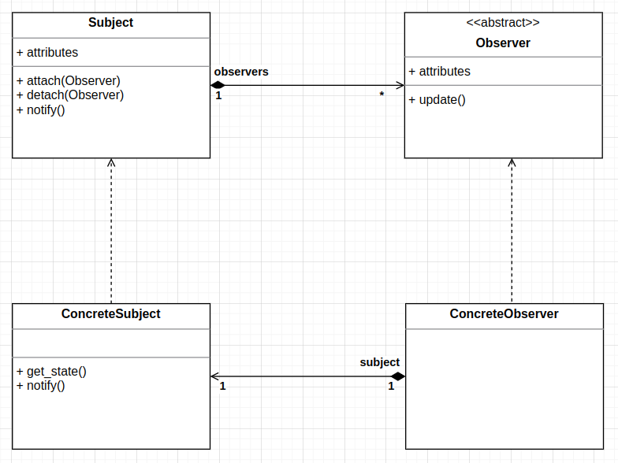

# Observer

# Definitions
- Maintains a list of dependents(Observers) so that the Subject can notify all the Observers about the changes that it 
undergoes using any of the methods defined by the Observer.
- It defines one-to-many deendency between objects so that any change in one object will be notified to the other 
dependent objects automatically.
- It encapsulates the core component of the Subject.

# Diagram

