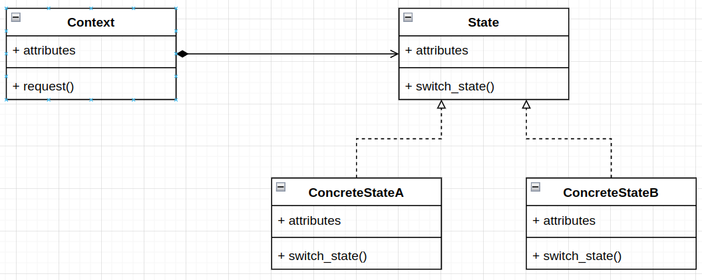

# State Design Pattern
Is a behavioral pattern.

# Definitions
- In this pattern an object can encapsulate multiple behaviors based on its internal state.
- Is also considered as a way for an object to change its behavior at runtime.
- This pattern allows an object to change its behavior when its internal state changes.
- Is used to develop Finite States Machines and helps to accommodate State Transaction Actions.

# Real world use case
A computer system can have multiple states such as On, Off, Suspend or Hibernate. If we want to manifest these states 
with the help of State design pattern, how will we do it?


# Understanding the State design pattern
### Works with the help of three main entities
- State: encapsulates the states changes.

```python
from typing import List

from abc import ABC, abstractmethod

class ComputerState(ABC):  # Abstract State

    @property
    def name(self):
        return self.__class__.__name__

    @property
    @abstractmethod
    def allowed(self) -> List[str]:
        """
        :return: list of the allowed states
        """

    def switch(self, state):
        if state in self.allowed:
            print(f'Current: {self}, switched to new state: '
                  f'{state().__class__.__name__}')
            self.__class__ = state
        else:
            print(f'Current: {self}, switched to state: '
                  f'{state().__class__.__name__} not possible')

    def __str__(self):
        return self.name
```

- ConcreteState: class that implement the abstract class ComputerState. Implements the behavior associated 
with the object's particular state
```python
class Off(ComputerState):  # Concrete State

    @property
    def allowed(self):
        return [On]


class On(ComputerState): # Concrete State

    @property
    def allowed(self):
        return [Off, Suspend, Hibernate]


class Suspend(ComputerState): # Concrete State

    @property
    def allowed(self):
        return [On]


class Hibernate(ComputerState): # Concrete State

    @property
    def allowed(self):
        return [On]
```

- Context: It also maintains a reference to the object's current state. Accepts the client's request. 
```python
class Computer:  # Context
    """
    It also maintains a reference to the object's current state.
    Accepts the client's request.
    """
    def __init__(self, model='HP'):
        """
        Defines the base/initial state of the computer
        :param model:
        """
        self.model = model
        self.state = Off()  # base/initial state

    def change_state(self, concrete_state):
        """
        Will change the state of the object(self.state), and the actual change
        in bahavior is implemented by the ConcreteState
        classes(On, Off, Suspend and Hibernate)
        :param concrete_state: On, Off, Suspend and Hibernate
        """
        self.state.switch(concrete_state)
```

# Diagram



# Advantages
- An object's behavior is the result of the function of its state, and the behavior gets changed at runtime depending 
on the state. This removes the dependency on the if/else or switch/case conditional logic.
- The benefits of implementing polymorphic behavior are evident, and it is also easier to add states to support 
additional behavior.
- Also improves Cohesion since state-specific behaviors are agreggated into the ConcreteState classes, which are 
placed in one location in the code.
- It is very easy to add a behavior by just adding one more ConcreteState classes.

# Disadvantages
- Class Explosion: since every state needs to be defined with the help of ConcreteState, there is a chance that we 
might end up writing many more classes with a small functionality. Consider the case of finite state machines - if there 
are many states but each state is not too different from another state, we'd still need to write them as separate 
ConcreteState classes. This increases the amount of code we need to write, and it becomes difficult to review 
the structure of a state machine.
- With the introduction of every new behavior(even though adding behavior is just adding one more ConcreteState), 
the Context class needs to be updated to deal with each behavior. This makes the Context behavior more brittle with 
every new behavior. 