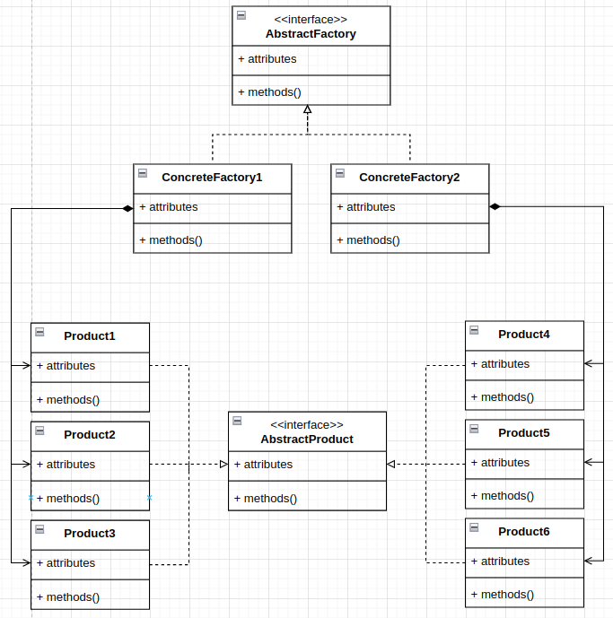

# Abstract Factory

# Definitions
- Is a creational pattern.
- A pattern useful for creating families of related or dependent objects without specifying their concrete classes.
- An abstract factory can produce a family of classes.
- Encapsulates objects instantiation, which supports dependency inversion so that clients can write to an abstraction and 
not an implementation.
- An abstract factory can produce a family of classes. It also enforces dependencies between the concrete classes.
- Abstract factory goes one better by supporting families of objects.

# Diagram

- Starting from the top, there is an AbstractFactory interface, In this example, it stipulates that three methods must 
be implemented for different products. In the example we looked at, there are actually three products for the 
economy, sport, and luxury models. 
- The diagram shows two factories, one for each product type or a car manufacturer in the example. Each factory makes 
different products and those products implement an AbstractProduct base class. Finally, we have concrete product 
classes for each ConcreteFactory, 1 set up for ConcreteFactory1, which makes the Product1, Product2 and Product3 and 1 
set up for ConcreteFactory2, which makes the Product4, Product5 and Product6 products. Naturally, this can be extended 
to more product types and more factories.