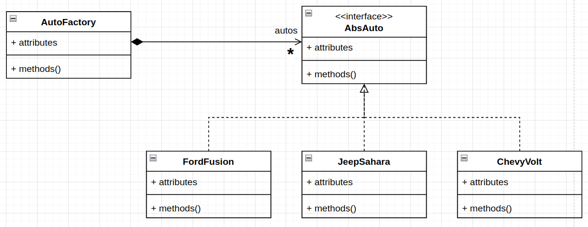
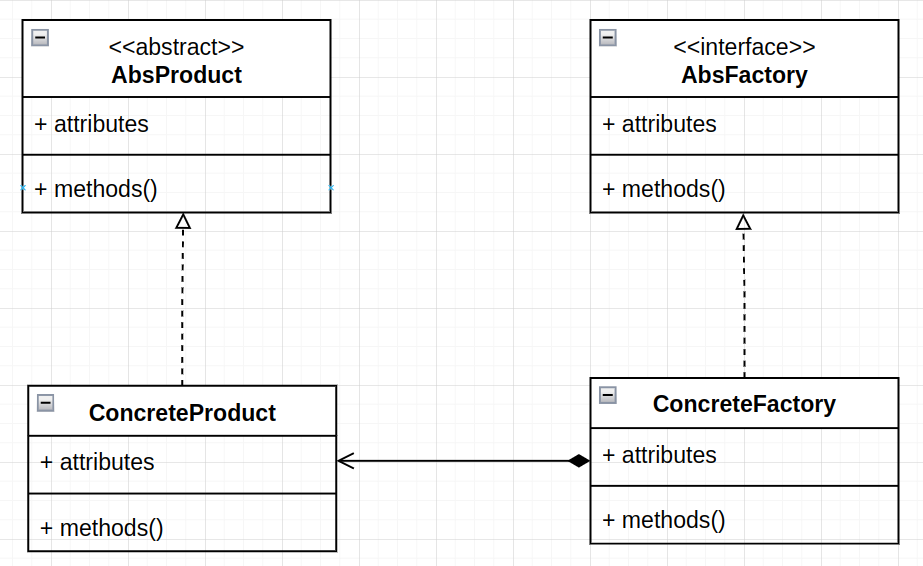

# Factory

# Definitions
- Is a creational pattern.
- Factories are places where things are created.
- There are two ways to implement the factory pattern: Simple Factory and Full Factory.

# Diagram Simple Factory

- Starting at the right there is an AbsClass that has two methods that must be implemented in the classes that 
implement this interface. 
- At the bottom left there are three concrete classes that implement the interface’s methods.
- At the right there is a Factory class. This class has the job of creating and returning an instance of the 
desired class.
- The factory class has a factory method that encapsulate class instantiation. We no longer have to instantiate a 
class directly, instead we can call factory method to do it for us. 
- We're limited to one factory.

# Diagram Full Factory

- At the top left, there's an AbsProduct class abstract. That is what we want the factory to produce,  that's a car. 
- Bottom left is the ConcreteProduct that will be produced. There will be one per product type, or car model.
- Top right is an AbsFactory interface. It declares one method to be implemented, to create_product method. 
- Bottom right is the ConcreteFactory. The implementation of the create_auto method returns the finished car.
- Many factories and many factory types can be implemented, and those implementations can vary.
- A complex factory might use other patterns to help, such as the builder pattern.
